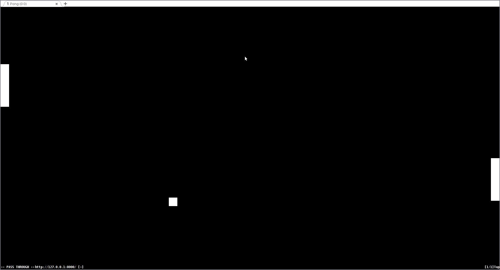

# Pong-py

**NB! The code is terrible, game has ton of bugs and the performance is absusrd — this was just a quick hack put together in a hurry to see how a game written in Python would run in browser!**

Pong game in Python, run in browser using
[Brython](http://www.brython.info/index.html). Made together with
[siers](https://github.com/siers) at
[Python Latvia Project Nights](http://python.lv/).

## Installation

~~~
./install-brython.sh
sass main.sass > main.css
python -m http.server
~~~
